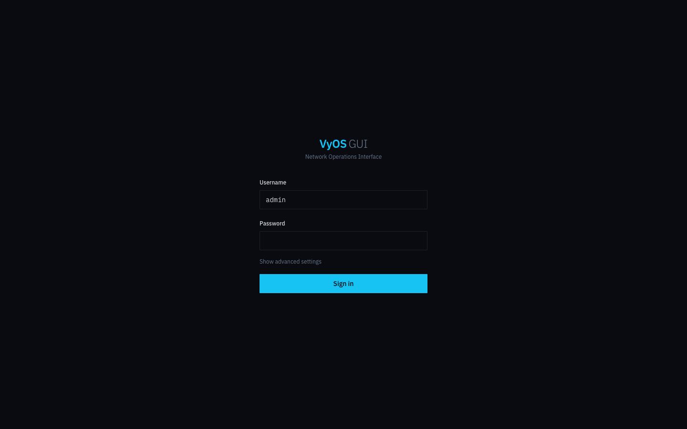
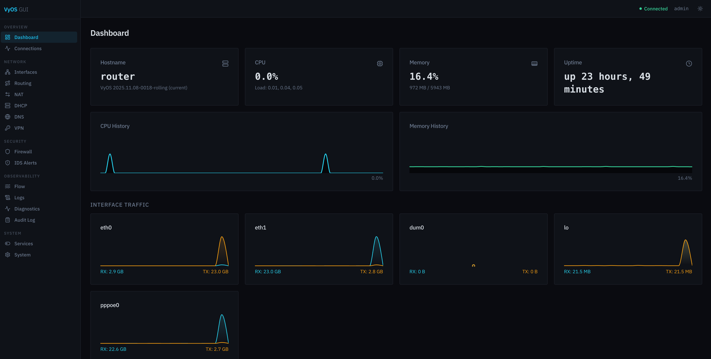

# VyOS GUI

A self-hosted web interface for [VyOS](https://vyos.io/) Community Edition. Manage your homelab router without memorising CLI syntax.





## Features

| Section | Capabilities |
|---|---|
| **Dashboard** | CPU/memory history charts, interface traffic sparklines, uptime |
| **Interfaces** | List all interfaces, view/edit IPs, enable/disable, link state |
| **Routing** | Static routes CRUD, full routing table (RIB) viewer |
| **Firewall** | Rules per chain (input/forward/output + named), firewall groups |
| **NAT** | Source & destination NAT rules, add/delete |
| **DHCP** | Pools, active leases with MAC/hostname/expiry |
| **DNS** | Forwarding nameservers, listen addresses, domain overrides |
| **VPN** | WireGuard interface config, peer management, live status |
| **Diagnostics** | Ping, traceroute (from router), ARP table |
| **System** | Hostname, NTP, login users, config viewer, reboot/poweroff |

## Quick Start

### Prerequisites

- Docker & Docker Compose v2
- VyOS rolling release router (tested on VyOS 1.4 / 2025.x)

### 1. Enable the VyOS HTTP API (optional but recommended)

On your VyOS router:

```
configure
set service https api keys id gui key YOUR-SECRET-KEY
set service https api allow-client address 0.0.0.0/0
commit
save
```

Without an API key the GUI falls back to SSH for all operations.

### 2. Deploy

```bash
git clone https://github.com/youruser/vyos-gui.git
cd vyos-gui
cp .env.example .env
```

Edit `.env`:

```bash
# Generate a strong secret key:
#   python3 -c "import secrets; print(secrets.token_hex(32))"
SECRET_KEY=your-32-byte-hex-secret

GUI_USERNAME=admin
# Generate a password hash:
#   python3 -c "
#   import hashlib, hmac
#   secret = 'your-32-byte-hex-secret'
#   plain = 'your-gui-password'
#   print(hashlib.pbkdf2_hmac('sha256', plain.encode(), secret.encode()[:16], 260000).hex())
#   "
GUI_PASSWORD_HASH=your-pbkdf2-hex-hash

VYOS_HOST=10.10.10.1
VYOS_SSH_USER=vyos
VYOS_SSH_PASSWORD=vyos
VYOS_API_KEY=YOUR-SECRET-KEY        # from step 1; leave blank to force SSH-only
VYOS_API_URL=https://10.10.10.1
VYOS_TLS_VERIFY=false               # VyOS uses a self-signed cert by default
```

```bash
docker compose up -d
```

Open **http://localhost:3000** and log in.

## Architecture

```
Browser → React (port 3000) → FastAPI backend (port 8000) → VyOS HTTP API / SSH
```

- **Backend**: Python 3.12 + FastAPI. Tries the VyOS HTTP REST API first; falls back to Paramiko SSH if the API key is not set or unreachable.
- **Frontend**: React 18 + TypeScript + Vite + Tailwind CSS + shadcn/ui + Recharts.
- **Auth**: JWT session cookie; VyOS credentials are AES-encrypted inside the session token and never stored on disk.

## Development

### Backend

```bash
cd backend
python -m venv .venv && source .venv/bin/activate
pip install -r requirements.txt
uvicorn main:app --reload --port 8000
```

### Frontend

```bash
cd frontend
npm install
npm run dev   # http://localhost:5173
```

### Tests

```bash
cd backend
pytest tests/
```

## Environment Variables

| Variable | Description | Default |
|---|---|---|
| `SECRET_KEY` | 32-byte hex key for JWT signing + password hashing | — |
| `GUI_USERNAME` | GUI login username | `admin` |
| `GUI_PASSWORD_HASH` | PBKDF2-SHA256 hex of the GUI password | — |
| `VYOS_HOST` | Router IP or hostname | `10.10.10.1` |
| `VYOS_PORT` | SSH port | `22` |
| `VYOS_SSH_USER` | SSH username | `vyos` |
| `VYOS_SSH_PASSWORD` | SSH password | — |
| `VYOS_API_KEY` | VyOS HTTP API key (enables REST mode) | — |
| `VYOS_API_URL` | VyOS HTTPS base URL | `https://10.10.10.1` |
| `VYOS_TLS_VERIFY` | Verify TLS cert | `false` |
| `CORS_ORIGINS` | JSON array of allowed CORS origins | `["http://localhost:3000"]` |

## Security Notes

- GUI authentication uses PBKDF2-SHA256 (260 000 iterations) — not bcrypt, to avoid issues with Docker Compose variable substitution on bcrypt hashes.
- VyOS credentials are stored only in the encrypted session cookie; they are never written to disk or logged.
- All config paths are validated server-side with strict regex to prevent injection.
- Destructive operations (reboot, poweroff, firewall rule delete) require a 60-second confirmation token.

## License

MIT — see [LICENSE](LICENSE).
